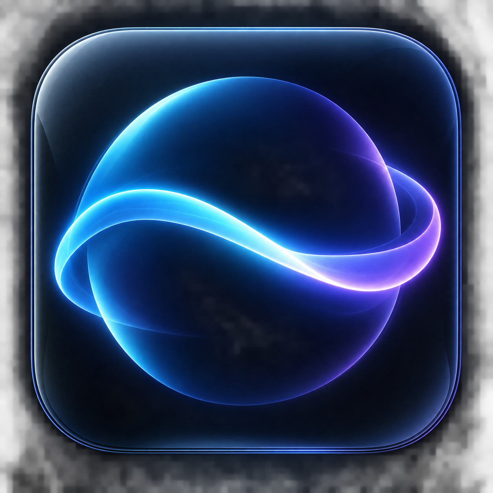
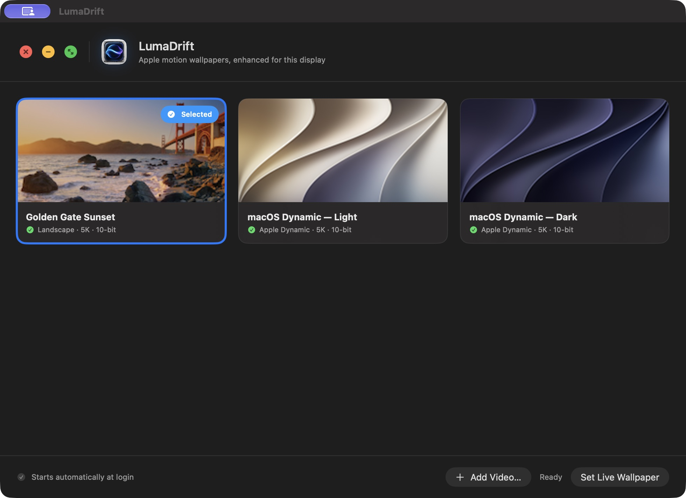

<p align="center">
  
</p>
<h1 align="center">LumaDrift</h1>
<p align="center"><strong>Motion, uninterrupted.</strong><br>Turn Apple's motion wallpapers—or any video—into a continuously moving Mac desktop.</p>
<p align="center">macOS 14+ · Apple silicon · Native Swift · Open source</p>
<p align="center">
  <a href="https://github.com/est1994ap-del/LumaDrift/releases/latest">Download</a> ·
  <a href="docs/USING.md">How to use</a> ·
  <a href="#see-it-in-action">Screenshot</a> ·
  <a href="https://github.com/est1994ap-del/LumaDrift/issues">Feedback</a>
</p>

LumaDrift is made for people who just want the wallpaper to move. There are no
Terminal commands, developer tools, or configuration files needed when using
the installer. Install the app, press one setup button, choose a wallpaper, and
you are done.

> **Apple's videos are not bundled.** LumaDrift reads the motion-wallpaper
> catalog already on your Mac and downloads compatible videos directly from
> Apple. Your own imported videos never leave your Mac.

## See it in action

<p align="center">
  
</p>

*The real running LumaDrift app—not a mockup. Available Apple wallpapers can
vary with the catalog installed by macOS.*

## Install in four clicks

1. Download **`LumaDrift-1.0.0-macOS-arm64.pkg`** from the [latest release](https://github.com/est1994ap-del/LumaDrift/releases/latest).
2. Double-click it and follow the Mac installer.
3. Open **LumaDrift** from Applications.
4. Click **Set Up LumaDrift** once. When preparation finishes, choose a card and click **Set Live Wallpaper**.

The first setup downloads and prepares high-quality video, so it can take a
while and use several gigabytes of storage. You can leave LumaDrift open while
it works.

The first public build is independently distributed and not yet notarized. If
macOS blocks it, Control-click the installer, choose **Open**, then confirm
**Open** once. See the [plain-English installation guide](docs/INSTALLATION.md)
for step-by-step help.

## What it does

- **Keeps moving while you work.** Motion continues behind Finder icons and app windows.
- **Feels like a Mac app.** Native close, minimize, zoom, move, and resize controls.
- **Finds Apple's motion wallpapers.** Compatible videos come straight from Apple's catalog.
- **Accepts your own videos.** Click **Add Video…** and choose a movie from your Mac.
- **Prepares display-shaped 5K video.** Apple catalog videos are cropped to the display and prepared as 60 fps, 10-bit HEVC.
- **Works across displays and Spaces.** One click-through background is created for each display.
- **Starts automatically.** Your chosen wallpaper returns when you sign in.
- **Respects Mac sleep settings.** LumaDrift does not prevent display sleep or override battery-saving settings.

## Use your own video

Open LumaDrift, click **Add Video…**, choose a movie that plays in QuickTime,
select its new card, and click **Set Live Wallpaper**. LumaDrift keeps a managed
copy, so moving the original later will not break the wallpaper.

## Privacy

LumaDrift has no account, telemetry, analytics, advertising SDK, or cloud
relay. Preferences, thumbnails, prepared videos, and imported movies stay in
`~/Library/Application Support/LumaDrift`.

Continuous high-resolution video uses more energy than a still image. LumaDrift
allows the display to sleep and leaves macOS battery controls intact. This
independent project is not affiliated with or endorsed by Apple.

## For developers

The installer is for normal users. Developers who want to inspect or change the
source can clone the repository and build it with Apple's free Command Line
Tools:

```sh
git clone https://github.com/est1994ap-del/LumaDrift.git
cd LumaDrift
./install.sh
```

See [Installation](docs/INSTALLATION.md), [Using LumaDrift](docs/USING.md), and
the [release checklist](docs/RELEASING.md) for details.

## License

LumaDrift source is available under the [MIT license](LICENSE). Apple wallpaper
videos and user-imported media are not included in that license and are never
committed to this repository.
